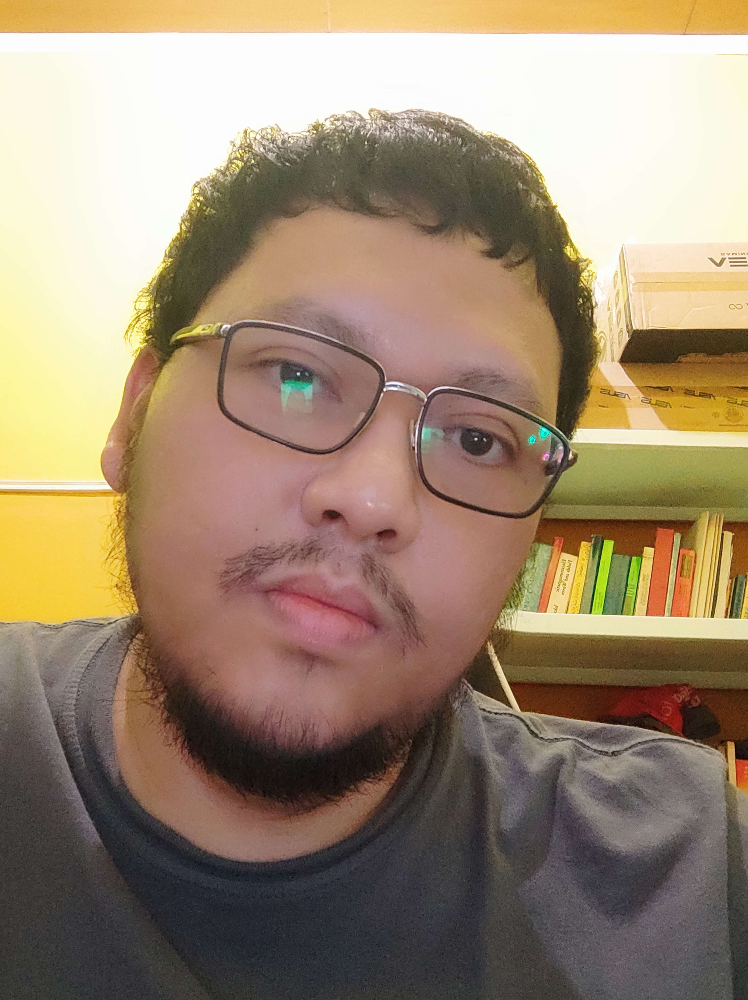

<!-- Heading -->
# Isnendyan Kresna Purnama

<!-- Subheading -->
## Title
> This is an assignment for week 0 test RevoU. The task is creating a simple Bio Profile with Markdown.

<!-- Greeting -->
## Hi there 👋

<!-- profile picture mini size -->

<!-- introduction bio paragraph -->

My name Isnendyan Kresna Purnama.I'm currently learning about Fullstack Software Engineering at RevoU indonesia.I decided to become a Fullstack Software Engineer because I was curious about how to make a web design. And every day we don't forget to use the web, that's when I was curious about how to create a web that we use every day.I hope I can be a Fullstack Software Engineer and can make a good web design.

<!-- Social media link  -->

## My Social Media

How to reach me. this is my social media:

1. [github](https://github.com/isnendyankp)
2. [linkedin](https://www.linkedin.com/in/isnendyan-kresna-purnama-a20836244/)